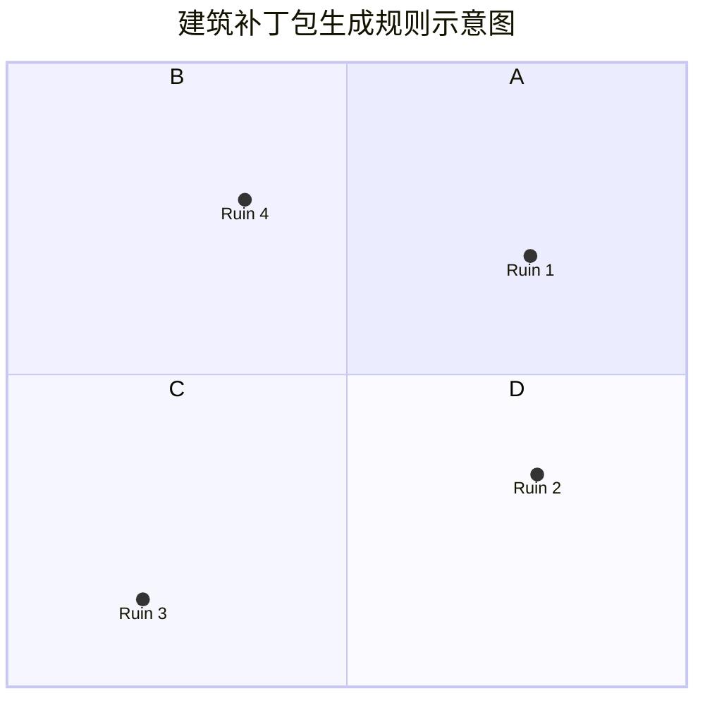

这部分内容介绍了建筑生成算法。

<blockquote class="prompt-info">
以下内容仅跟进到1.9.3R2版本，数据仅供参考
</blockquote>

<blockquote class="prompt-warning">
由于游戏特性，所有的建筑只有走到眼前才会加载（你可以把模拟距离调高）
</blockquote>

## 遗迹生成

当你加载一个群系时，游戏将会在每一个区块生成时尝试放置一次结构。因此，你每加载一个区块，都相当于在抽奖~~想想就很有意思~~

我们列出以下表格，供各位参考。结构只会在群系匹配的时候，才会有概率生成，所以一定要找对群系。

| 建筑名                   | 群系                                                  | 高度     | 概率（%） |
| ------------------------ | ----------------------------------------------------- | -------- | :-------: |
| abyssal_tower            | ocean                                                 | -60      |   0.05    |
| everlasting_winter_tower | 非 lakes、ocean、river 且为 frozen 群系               | ~ - 11   |    0.1    |
| hunter_house             | 无明确要求                                            | ~ - 1    |   0.15    |
| frozen_crate             | frozen 群系                                           | [~, ~+1] |     3     |
| plain_tower              | plains 且非 river、lakes、ocean、mountain、hills 群系 | ~ - 13   |   0.06    |
| giant_tree               | 非 lakes、ocean、river 且为 forest 群系               | ~ - 11   |    0.1    |
| challenger_towers        | 非 lakes、ocean、river、nether、the_end 群系          | ~ - 65   |   0.015   |
| bat_cave                 | 非 lakes、ocean、river 且为 mesa 群系                 | ~ - 24   |   0.09    |
| illusioner_house         | 非 lakes、ocean、river 且为 jungle 群系               | ~ - 0    |   0.06    |
| warehouse_of_watcher     | 非 lakes、ocean、river 且为 mesa 群系                 | ~ - 3    |   0.06    |
| altar                    | 非 lakes、ocean、river、the_end、nether 群系          | ~ - 0    |    0.1    |
| enchanted_house          | 非 lakes、ocean、river 且为 jungle 群系               | ~ - 2    |   0.06    |
| ruined_house             | overworld_generation 群系                             | ~ - 1    |   0.08    |
| soul_room                | soulsand_valley                                       | 0        |   0.08    |
| deep_garden              | crimson_forest                                        | [15,83]  |    0.2    |
| ash_castle               | basalt_deltas                                         | [2,6]    |    0.2    |

## 遗迹生成（建筑补丁包）

### 介绍

传统的建筑生成非常看脸，对于非尊玩家非常不友好，特别是主线推不下去。那么有没有改进方案呢？有！

建筑补丁包请置于本体前加载。它改进了几个 boss 的生成建筑算法。简而言之就是，不会太多，也不会太少，疏密刚好。

### 详细算法

新的算法中，世界会被划成若干个格子，然后每个格子里面随机取一个点（对于相同的种子相同），这个点将会根据对应的群系生成一个对应的 boss 建筑。示意图如下。

当然，这个规则对于部分建筑应该进行一些修改。比如永冬塔。对于雪地，将会采用一套不同的划分格子大小，这样生成数量就下降了。

生成建筑的划分格子大小表格如下：

| 建筑名                   | 网格大小（方块） |
| ------------------------ | :--------------: |
| abyssal_tower            |       324        |
| ash_castle               |       324        |
| bat_cave                 |       256        |
| deep_garden              |       324        |
| enchanted_house          |       324        |
| everlasting_winter_tower |       512        |
| giant_tree               |       324        |
| plain_tower              |       324        |
| soul_room                |       324        |
